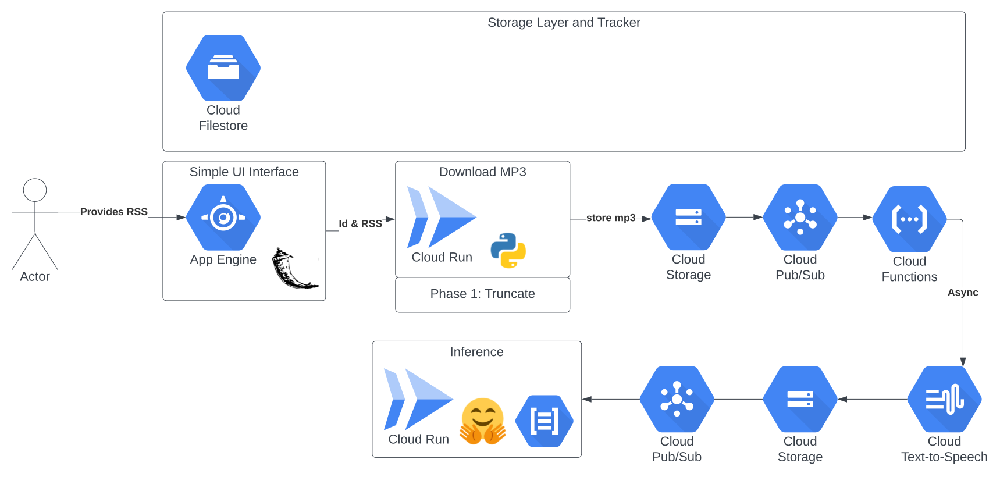

# Objective

Leverage GCP Services and Open Source tools to convert Audo to text and then extract text into key topics. The big idea is effectively identifying key concepts discussed on Podcast.

# High Level Design

## Dataflow Schema - Basic

### Podcast Search

- [podsearch](https://pypi.org/project/podsearch/)
- [podsearch github](https://github.com/nalgeon/podsearch-py)
- [itune search api](https://developer.apple.com/library/archive/documentation/AudioVideo/Conceptual/iTuneSearchAPI/index.html)
  Media Type = 'podcast'
  Available Entities = [podcastAuthor, podcast]
  Potential Attributes = [titleTerm, languageTerm, authorTerm, genreIndex, artistTerm, ratingIndex, keywordsTerm, descriptionTerm]
- Note: Minor Surgery to add 'releaseDate' to podcast date

### Podcast Download

- [getpodcast](https://pypi.org/project/getpodcast/)
- [pyPodcastParser](https://pypi.org/project/pyPodcastParser/)
- [podcast-downloader](https://pypi.org/project/podcast-downloader/)
- [feedparser](https://pypi.org/project/feedparser/)

## Model Development

- Evaluate Transfer Learning
- Evaluate GCP UI
