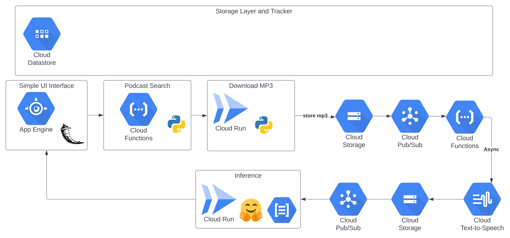

# Objective

Leverage GCP Services and Open Source tools to convert Audo to text and then extract text into key topics. The big idea is effectively identifying key concepts discussed on Podcast.

# High Level Design

## Dataflow Schema - Basic

### RSS notes

- [RSS Schema](https://en.wikipedia.org/wiki/RSS_enclosure)

### Podcast Search

- [podsearch](https://pypi.org/project/podsearch/)
- [podsearch github](https://github.com/nalgeon/podsearch-py)
- [itune search api](https://developer.apple.com/library/archive/documentation/AudioVideo/Conceptual/iTuneSearchAPI/index.html)
  Media Type = 'podcast'
  Available Entities = [podcastAuthor, podcast]
  Potential Attributes = [titleTerm, languageTerm, authorTerm, genreIndex, artistTerm, ratingIndex, keywordsTerm, descriptionTerm]
- Note: Minor Surgery to add 'releaseDate' to podcast date

### Podcast Download

- [getpodcast](https://pypi.org/project/getpodcast/)
- [pyPodcastParser](https://pypi.org/project/pyPodcastParser/)
- [podcast-downloader](https://pypi.org/project/podcast-downloader/)
- [feedparser](https://pypi.org/project/feedparser/)
- [mutagen](https://mutagen.readthedocs.io/en/latest/index.html)

https://en.wikipedia.org/wiki/RSS_enclosure
length is size in bytes

### MP3 Audio to Text

- [GCP Speech-to-Text](https://cloud.google.com/speech-to-text)
- [GCP Speech-to-Text Docs](https://cloud.google.com/speech-to-text/docs)
- [GCP Python Client](https://cloud.google.com/python/docs/reference/speech/latest)
- [GCP Transcribe](https://cloud.google.com/speech-to-text/docs/transcribe-client-libraries)
- [HuggingFace Inference API Overview](https://huggingface.co/docs/api-inference/index)
- [HuggingFace Inference API Audio Example](https://huggingface.co/docs/api-inference/detailed_parameters#automatic-speech-recognition-task)
- [HuggingFace Speech2Text2](https://huggingface.co/docs/transformers/model_doc/speech_to_text_2)
- [HuggingFace Model Card](https://huggingface.co/facebook/wav2vec2-large-960h-lv60-self)
- [Open AI Whisper](https://openai.com/blog/whisper/)
- [Assembly AI](https://www.assemblyai.com/pricing)
- [FFMEG](https://ffmpeg.org/download.html)
- [Whisper Python](https://pypi.org/project/whisper.ai/)
- [Python FFMPEG](https://github.com/kkroening/ffmpeg-python)
  Cost Considerations
  Assemble AI - $0.00025 per second - .015/ minute
  Google Cost $0.016 / minute
  $10 worth; ~60 minutes per $1
  Hugging Face - Rate Limits, unclear what. Pro plan is ~$10 a month

### Text Models

Objective - take transcripts and parse out entity and key topics;
Evaluate transfer learning in phase II - get RSS Tags

Approaches
**Token Classification**

- [RoBerta](https://huggingface.co/docs/transformers/model_doc/roberta)
- **[KeyBERT pypi](https://pypi.org/project/keybert/)**
- [Transformer Tutorial - pipelines](https://huggingface.co/course/chapter2/2?fw=pt)
- **Keyword Extraction**
  Topic Modeling, TFIDF, Expand Rank, Position Rank - leverage several text documents. Focus on a single text
  [article 1](https://www.analyticssteps.com/blogs/top-5-keyword-extraction-algorithms-nlp)
  [article 2](https://towardsdatascience.com/keyword-extraction-with-bert-724efca412ea)
  [flair NLP](https://github.com/flairNLP/flair/blob/master/resources/docs/TUTORIAL_1_BASICS.md)
  **[pke](https://github.com/boudinfl/pke)**
  [spacy](https://spacy.io/usage/models)
  [gensim](https://radimrehurek.com/gensim/)
  [sentencepiece](https://github.com/google/sentencepiece)
  [sbert](https://www.sbert.net/)

### App Engine - Flask Entry Point

Object is to create a Flask front end using App Engine.

- Search for podcast <- Cloud Function
- Show RSS feed <- Cloud Function
- Kick off asynchronous download - return id <- Cloud Run
- Get Keyword Results <- (FastAPI FireStore)
- Download Transcripts <- (FastAPI FireStore)

[Google Docs](https://cloud.google.com/appengine/docs/standard/python3/runtime)
[Flask Docs](https://flask.palletsprojects.com/en/2.2.x/)
[App YAML](https://cloud.google.com/appengine/docs/standard/reference/app-yaml?tab=python)
[Flask Minimal App](https://flask.palletsprojects.com/en/2.2.x/quickstart/#a-minimal-application)
Inside templates you also have access to the config, request, session and g objects as well as the url_for() and get_flashed_messages() functions.
[Flask Template Inh.](https://flask.palletsprojects.com/en/2.2.x/patterns/templateinheritance/)

If need to be dynamic
[Flask Dynamic] (https://flask.palletsprojects.com/en/2.2.x/patterns/javascript/)
--> idea is to get this into vue over time
[Vue](https://vuejs.org/guide/quick-start.html#using-vue-from-cdn)

-- Forms to manage server side
[Flask Forms](https://flask-wtf.readthedocs.io/en/1.0.x/)
[Bootstrap Flask](https://bootstrap-flask.readthedocs.io/en/stable/basic/)
[Bootstrap5](https://getbootstrap.com/docs/5.1/getting-started/introduction/)
[Bootstrap Flas Render](https://bootstrap-flask.readthedocs.io/en/stable/macros/#render_form)

### Cloud Function
Objective is creating an HTTP service that accepts search phrases - stores search term and search results in datastore with user key. App Engine -> Cloud Function -> Api -> Datastore -> App Engine gets key -> Retrieve Results
Cloud function should require authentication

[GCP Cloud Function Basic Deploys](https://cloud.google.com/functions/docs/create-deploy-gcloud)
[GCP Write Cloud Function](https://cloud.google.com/functions/docs/writing)
[Flask Request](https://tedboy.github.io/flask/generated/generated/flask.Request.html)
[HTTP triggers](https://cloud.google.com/functions/docs/calling/http)
[Flask Response](https://flask.palletsprojects.com/en/2.1.x/quickstart/#about-responses)
In summary - effectively a Flask API that accepts all REST types
[Local Testing](https://cloud.google.com/functions/docs/running/function-frameworks#functions-local-ff-install-python)
[Real Python Requests](https://realpython.com/python-requests/)

### Firestore
Objective is using Firestore with application. 

[GCP Docs](https://firebase.google.com/docs/firestore)
[Data Model](https://firebase.google.com/docs/firestore/data-model)
[Python Admin SDK](https://firebase.google.com/docs/reference/admin/python/)
[Python Firestore Client](https://cloud.google.com/python/docs/reference/firestore/latest/index.html)

hierarchical -> collection -> subcollection design

* users (future state)
  * devices (session/cookie based)
    * searches
    * downloads
    * transcripts
    * keywords

Thought process -> each activity could be done independenly or in a sequential manner. Keys will roughly be 'concept'+'timestamp (ms)'

[Index Exemption](https://stackoverflow.com/questions/69644815/firestore-how-to-exempt-a-field-from-being-indexed-via-java-code)

* Add index exemptions manually it appears for 
  * Large String Fields
  * Large Array or map fields 
